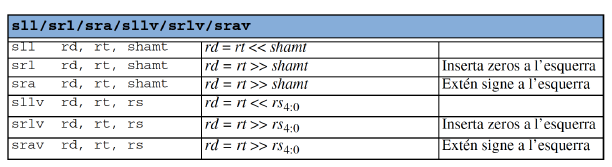

# **Resumen - Traducció de Programes (EC)**

## Índice
- <a href="#31-desplacaments-de-bits">3.1 Desplaçaments de bits</a>
- <a href="#32-operacions-logiques-bit-a-bit">3.2 Operacions lògiques bit a bit</a>
- <a href="#33-comparacions-i-operacions-booleanes">3.3 Comparacions i operacions booleanes</a>
- <a href="#34-salts">3.4 Salts</a>
- <a href="#35-sentencies-alternatives-if-then-else-i-switch">3.5 Sentències alternatives if-then-else i switch</a>
- <a href="#36-sentencies-iteratives-while-for-i-do-while">3.6 Sentències iteratives while, for i do-while</a>
- <a href="#38-estructura-de-la-memoria">3.8 Estructura de la memòria</a>
- <a href="#39-compilacio-assemblatge-enllacat-i-carrega">3.9 Compilació, assemblatge, enllaçat i càrrega</a>

<h3 id="31-desplacaments-de-bits">3.1 Desplaçaments de bits</h3>

### **Desplaçaments lògics**
```assembly
sll $t0, $t0, 1  # Desplaçament a l'esquerra
srl $t0, $t0, 2  # Desplaçament a la dreta
```
Multiplicar per 2^n → `sll`  
Dividir per 2^n:

- Unsigned: `srl`: añade ceros por la izquierda
- Signed: `sra`: si es positivo añade ceros y sino añade unos por la izquierda



- Operador <<: Instrucció sll o sllv.
- Operador >>: Instrucció srl/srlv si unsigned (natural) o sra/srva altrament.

### **Operacions bàsiques en C**
```c
a = ( a << b ) >> 2;
```
### **Traducció en MIPS**
```assembly
sllv $t4, $t0, $t1
sra $t0, $t4, 2
```


---

<h3 id="32-operacions-logiques-bit-a-bit">3.2 Operacions lògiques bit a bit</h3>

### **Operacions bàsiques en C**
```c
a = a & b; // AND bit a bit
a = a | b; // OR bit a bit
a = a ^ b; // XOR bit a bit
a = ~a;    // NOT bit a bit
```
### **Traducció en MIPS**
```assembly
and $t0, $t0, $t1
or $t0, $t0, $t1
xor $t0, $t0, $t1
nor $t0, $t0, $zero  # NOT bit a bit
```


---

<h2 id="33-comparacions-i-operacions-booleanes">3.3 Comparacions i operacions booleanes</h2>

### **Operadors en C**
```c
if (a < b) c = 1;
if (a != b) c = 0;
```
### **Traducció en MIPS**
```assembly
slt $t2, $t0, $t1  # a < b
seq $t2, $t0, $t1  # a == b
```

---

<h2 id="34-salts">3.4 Salts</h2>

### **Salt condicional en MIPS**
```assembly
beq $t1, $t2, etiqueta  # Si $t1 == $t2, salta a etiqueta
bne $t1, $t2, etiqueta  # Si $t1 != $t2, salta a etiqueta
```

---

<h2 id="35-sentencies-alternatives-if-then-else-i-switch">3.5 Sentències alternatives if-then-else i switch</h2>

### **Traducció d'un if-else en MIPS**
```c
if (a >= b) d = a;
else d = b;
```
```assembly
blt $t0, $t1, else
move $t3, $t0
j fi
else:
move $t3, $t1
fi:
```

### **Switch en MIPS amb Jump Table**
```assembly
.data
jumptable: .word default, case2, default, case4, default
.text
subu $t0, $t1, 1
sll $t0, $t0, 2
la $t4, jumptable
addu $t0, $t4, $t0
lw $t0, 0($t0)
jr $t0
```

---

<h2 id="36-sentencies-iteratives-while-for-i-do-while">3.6 Sentències iteratives while, for i do-while</h2>

### **While en MIPS**
```assembly
while:
bge $t1, $t2, end_while
subu $t1, $t1, $t2
b while
end_while:
```

### **For en MIPS**
```c
for (i = 0; i < n; i++) sum += i;
```
```assembly
li $t0, 0    # i = 0
li $t1, n    # n
li $t2, 0    # sum = 0
for_loop:
bge $t0, $t1, end_for
add $t2, $t2, $t0
addi $t0, $t0, 1
b for_loop
end_for:
```

---

<h2 id="38-estructura-de-la-memoria">3.8 Estructura de la memòria</h2>

### **Distribució de la memòria en MIPS**
- `.data` → Dades globals i variables estàtiques.
- `.stack` → Variables locals i paràmetres.
- `.heap` → Memòria dinàmica (malloc).

### **Exemple d'ús de la pila**
```assembly
addi $sp, $sp, -4
sw $t0, 0($sp)  # Empila valor
lw $t1, 0($sp)  # Desempila valor
addi $sp, $sp, 4
```

---

<h2 id="39-compilacio-assemblatge-enllacat-i-carrega">3.9 Compilació, assemblatge, enllaçat i càrrega</h2>

### **Procés de compilació**
1. **Compilació**: C -> Assemble.
2. **Assemblatge**: Assemble -> Màquina.
3. **Enllaçat**: Uneix múltiples fitxers objecte.
4. **Càrrega**: Executable -> Memòria.

### **Exemple de compilació separada**
```assembly
.text
.globl func
func:
    addi $v0, $zero, 10
    jr $ra
```

---
